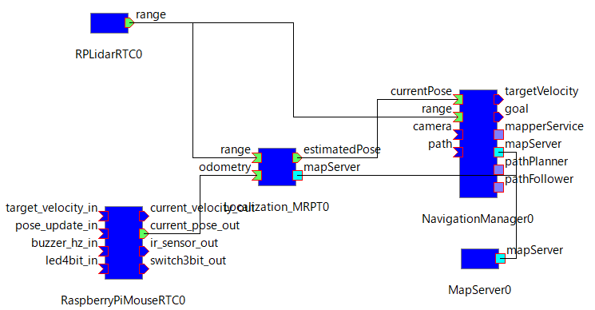
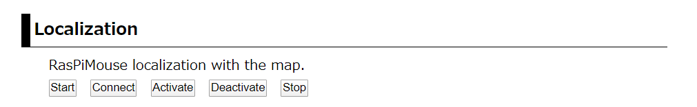
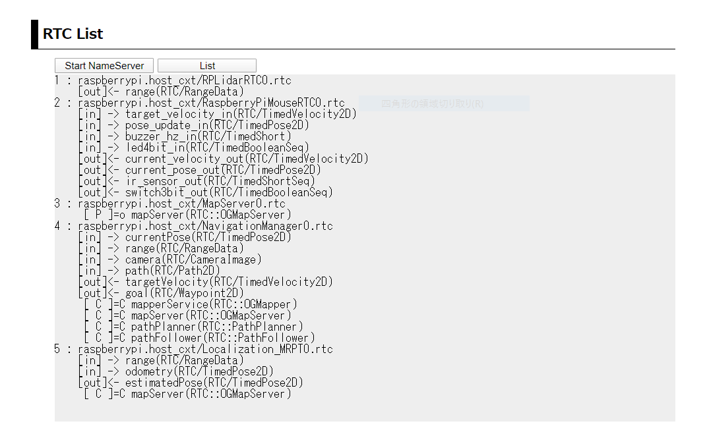
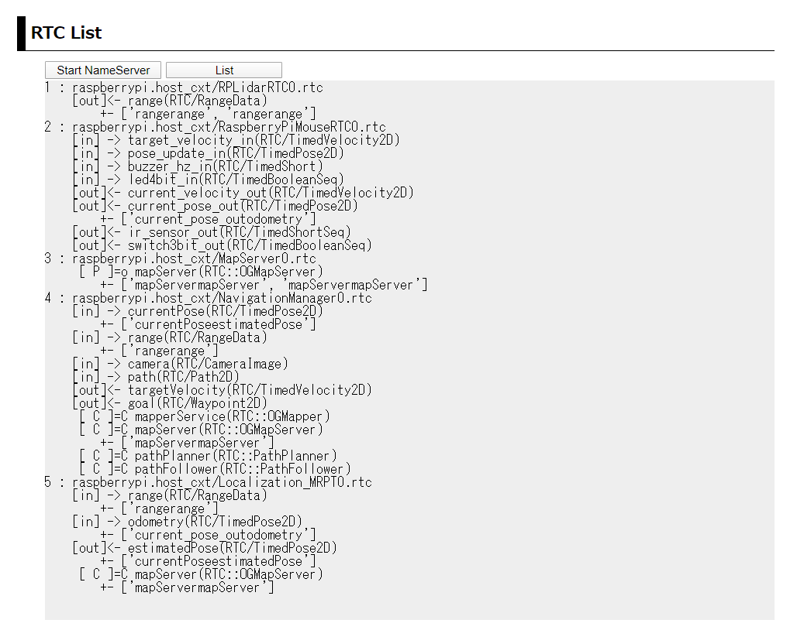
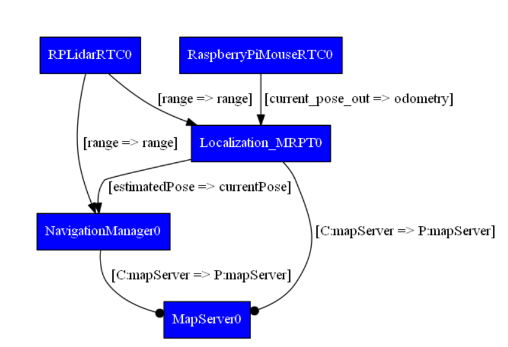
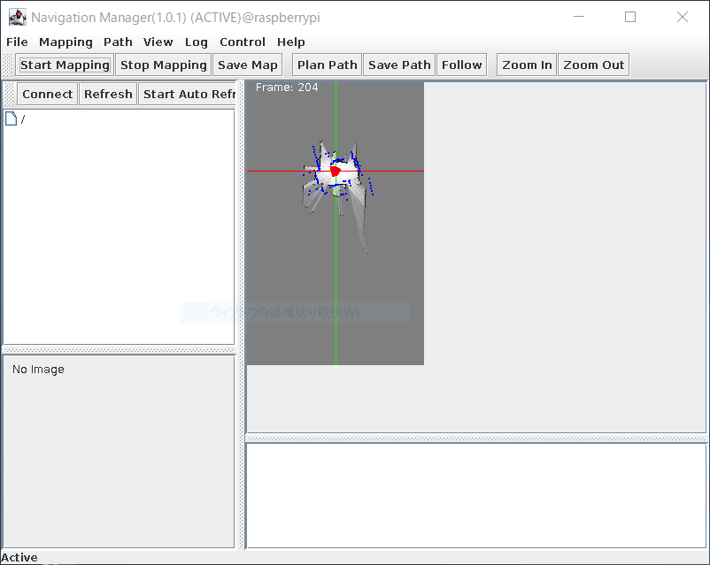
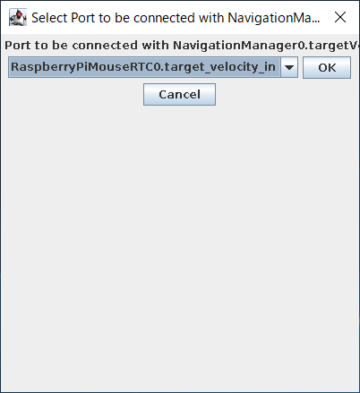
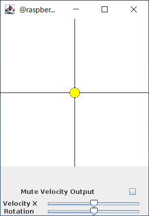

.. -*- coding: utf-8 -*-

概要
^^^^^^^^
このシステムでは、前述のナビゲーション地図作成システムにより生成した
地図とRasPiMouse2019に搭載したLiDARの情報をもとに
`Montecarlo localization <https://en.wikipedia.org/wiki/Monte_Carlo_localization>`_
を行うシステムです。

NavigationManagerに搭載されたJoystickでRasPiMouse2019を操作しながら、
自己位置同定を行います。

このシステムでは、RaspberryPiMouseRTC, RPLidarRTC, Localization_MRPT, MapServer, NavigationManagerの5つのRTCを使用します。
また、各RTC間の接続は、下図のようになります。

RTCの起動
^^^^^^^^^^^^^
RTCの起動は、Webブラウザを利用する場合には、トップページの第4セクション "Localiation"の部分を使用します。
ナビゲーションRTCのシステムに対しては、
下図のように「Start」、「Connect」、「Activate」、「Deactivate」、「Stop」の5つのオペレーションがあります。

ナビゲーション(自己位置同定)システムに必要なRTCの起動に「Start」を押下してください。
起動メッセージのページに遷移後、3秒後に自動でトップページに戻ります。

トップページに移行後、第2セクションの  "RTC List" には、現在起動中のRTCの一覧が
表示されますが、RTCによって起動時間が異なりますので、全てのRTCが起動完了するまで
しばらくお待ちください。

NavigationManagerをRasPiMouse側で起動する際は、あらかじめX ServerをローカルPCで
起動させたうえで、 このシステムを起動させてください。
NavigationManagerはGUI表示を伴いますので、 おそらく一番最後に起動すると思います。 
全てのRTCが起動すると、下図のようなNavigationManagerの操作パネルが表示されます。

NavigationManagerをローカルPC側で起動する場合は、ローカルPCでは X Serverを起動させずに、 
Webブラウザからシステムを起動します。この際、RasPiMouse側のNavigationManagerは、 
X Serverへ接続できませんので、エラーで終了します。一方、MapServerはそのまま起動
してしまいますので、Webページ上部の RT-Components のセクションにて、MapServer の
「Stop」リンクをクリックして停止させます。

NavigationManager/MapServerがRasPiMouseで起動していないことを確認したら、
前節でローカルPC側に ダウンロードした NavigationManager/MapServerを
それぞれ NavigationManager.bat、 MapServer.bat をクリックして起動します。

なお、前節でダウンロードしたNavigationManager/MapServer は、RasPiMouse側で
起動するRTCと 同じネームサーバの同じホストコンテキスト raspberrypi.host_cxt 
の下に登録されます。 これであたかも、これらのRTCがRasPiMouse上で起動されたように見えます。

また、第2セクションの「List」を押下すると下図のようにRTCのリストが表示されます。

Webブラウザを使用せずに、ターミナルでRasPiMouse2019にログインする場合には、
下記のコマンドを入力すると上記と同じ結果が得らえます。

.. code-block::

  $ /usr/local/openrtm/bin/location.sh start

ナビゲーション（自己位置同定）構築（ポートの接続）
^^^^^^^^^^^^^^^^^^^^^^^^^^^^^^^^^^^^^^^^^^^^^^^^^^^^^^^^
必要なRTCの起動後は、ナビゲーション（自己位置同定）システムを構成するために、
各RTCのポートの接続を行います。
最終的なシステム構成は、概要で表示した図の通りになります。
この構成を外部のRT System Editorを使って手動で接続しても良いのですが、
第4セクションの「Connect」ボタンを押下することで必要な接続を行うことができます。

ポートの接続後、第2セクションの「List」を押下すると下図のようなリストが得られます。

また、rtcmdを用いて graphコマンドを実行すると下図のようなシステム構成図を得ることができます。

また、Webブラウザを使用せずに、ターミナルでRasPiMouse2019にログインする場合には、
下記のコマンドを入力すると上記と同じ結果が得らえます。

.. code-block::

  $ /usr/local/openrtm/bin/location.sh connect

ナビゲーション（自己位置同定）の実行
^^^^^^^^^^^^^^^^^^^^^^^^^^^^^^^^^^^^^^
RTCのポート接続が完了後、ナビゲーション（自己位置同定）を行います。
本システムに係る5つのRTCをアクティベートしてください。

RTCのアクティベート
~~~~~~~~~~~~~~~~~~~~~~~~~
RTCのアクティベートの方法は、
Webブラウザ、ターミナルでログイン後にコマンド入力、
クライアントPC上のopenrtp、rtcmd等の外部ツールのいずれかを使用してください。

ここでは、Webブラウザとターミナルでログイン後のコマンドライン入力の2つの方法を紹介します。

Webブラウザでは、第4セクションの「Activation」ボタンを押下することで全てのRTCをアクティベートすることができます。
ターミナルからのコマンドライン入力では、下記のコマンドで同様に全てのRTCをアクティベートすることが可能です。

.. code-block::

  $ /usr/local/openrtm/localize.sh activate

すべてのRTCを有効化すると、下図のようにNavigationManagerの右側のペインにナビゲーション地図が表示され、
現在のRasPiMouse2019の位置が原点付近で探索され、表示されます。

現在のデフォルト設定では、/usr/local/openrtm/testMap.yamlを使用しますが、
他のナビゲーション地図を利用する場合には、
/usr/local/openrtm/etc/MapServer.confのパラメータを適宜修正してください。

Joystickパネルによる操作
~~~~~~~~~~~~~~~~~~~~~~~~~~~~~~~~~~~
ナビゲーション（自己位置同定）システムでは、NavigationManagerのJoystickパネルを用いて
手動でRasPiMouse2019を移動させることを想定しています。

NavigationManagerのJoystickは、メニューの [Control] -> [Start Control]を選択することで、
下図のような接続ダイアログが表示されますので、「OK」ボタンで選択してください。

正常にポート接続が完了すれば下図のような仮想Joystickが表示されますので、
RasPiMouse2019を移動させ、ナビゲーション地図上でRasPiMouse2019の自己位置が
推定されることを確認してください。

この自己位置推定では、オドメトリとLiDARの情報を使ってMontecarlo Localization
を行っています。
そのため、車輪のスリップによりオドメトリ値が大きく異なる場合には、
正しく自己位置を推定することはできません。

車輪のスリップを極力抑えるように車輪のメンテナンスをしてください。

ナビゲーション（自己位置同定）システムの終了
^^^^^^^^^^^^^^^^^^^^^^^^^^^^^^^^^^^^^^^^^^^^^^^^^
ナビゲーション（自己位置同定）システムの終了は、
Webブラウザの第3セクションの「Stop」ボタンを押下するか、
ターミナルでログイン後に下記のコマンド入力を行うことで行ってください。

.. code-block::

  $ /usr/local/openrtm/bin/location.sh stop

上記の例では、「Disconnct」と「Deactivate」を使用しませんでしたが、
起動中のRTCをそのまま使い経路計画システム等を実行する場合には適宜利用する
ことができます。
