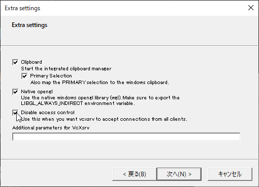
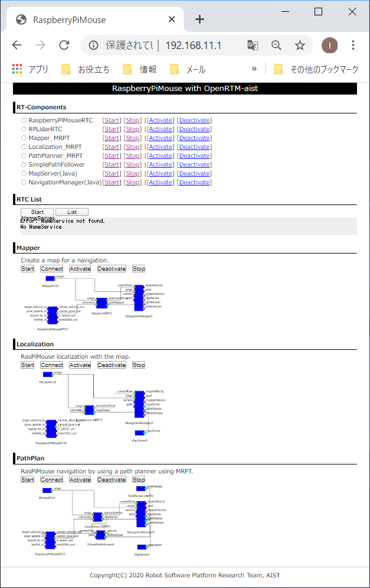
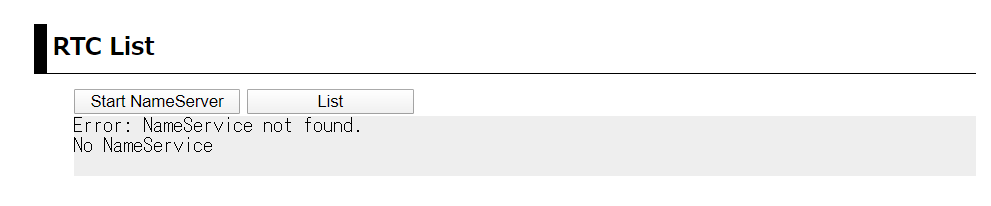
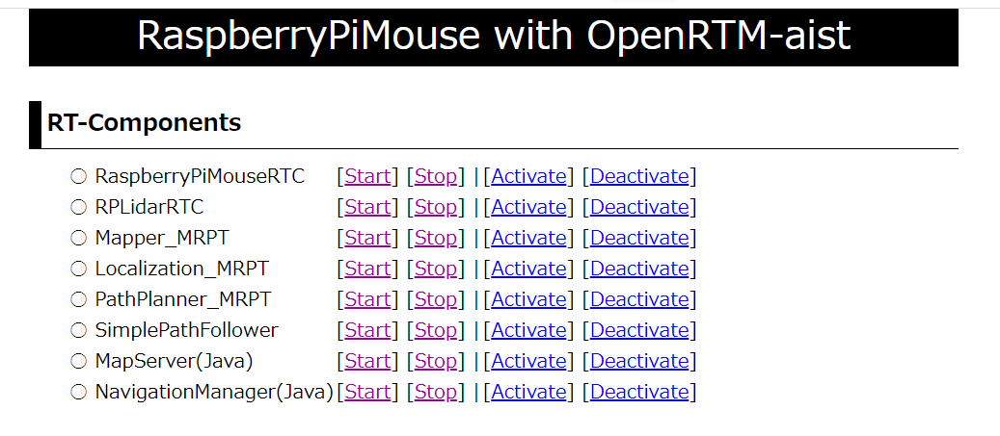

.. -*- coding: utf-8 -*-

RTコンポーネントの起動方法
==============================

.. contents:: 目次
  :depth: 3

ここでは、RasPiMouse2019を操作するRTC群の起動方法について説明します。
RasPiMouse2019のナビゲーションのためのRTC群は、以下の8種類あります。

* RaspberryPiMouseRTC: RaspberrryPiMouseドライバRTC
* RPLidarRTC: LiDAR制御RTC
* Mapper_MRPT: Map作成RTC
* Localization_MRPT: 自己位置推定RTC
* PathPlanner_MRPT: パス生成RTC
* SimplePathFollower: 経路追従RTC
* MapServer: マップサーバ
* NavigationManager: 操作GUI

これらのRTCはすべてRaspberryPiMouse上で動作させることもできますし、操作の都合上
MapServer/NavigationManager については、ノートPC側で動作させる方が便利なケースがあり
以下の2通りの方法から選択することができます。

+ MapServer/NavigationManager をPC、その他をRaspBerryPi上で起動する方法（推奨）
+ すべてのRTCをRasspberryPi上で起動する方法

ここでは、両方のケースについて説明していきます。

また、RaspberryPi上で起動するRTCの操作は、Webブラウザで操作する方法と
PCからssh(TeraTerm等のターミナルソフト) でRaspberryPiにログインして
操作する以下の2種類の方法があります。

+ Webブラウザ経由で起動・操作する方法（推奨）
+ sshログインして起動・操作する方法

これらの方法についてもそれぞれ説明します。

X-serverのインストールと起動
----------------------------------
この項目は、「MapServer/NavigationManager」をPCで起動する場合は
必要ありませんのでスキップしてください。

上記 NavigationManagerはGUI表示のあるRTCなので、通常RaspberryPi上で起動すると、
そのGUI画面はRaspberyPi上で表示されてしまいます。
ただし、Linux等の`X Window System <https://ja.wikipedia.org/wiki/X_Window_System>`_では、
特定のアプリケーション画面を他のPCに表示させることができるので、
この機能を応用すると、RaspberryPi上で実行するNavigationManagerのGUI画面を
手元のPCに表示させることができます。

この項目では、そのために必要な方法を説明していきます。
ただし、X Window System でGUI画面を表示させる方法は大きな通信帯域を
消費するため、操作はかなり重いものとなることをあらかじめご承知おきください。

X Window System を利用してWindows上でリモート（ここではRaspberryPi側）の
アプリケーションのGUI画面を表示させるには、X Serverと呼ばれるソフトウェアを
インストールする必要があります。

ここでは、無償のVcXsrvというX-serverを利用する方法を説明します。
まず、以下のURLから VcXsrv をダウンロードしてください。

* `VcXsrv <https://sourceforge.net/projects/vcxsrv/>`_ 

ダウンロードしたインストーラを実行してVcXsrvをインストールします。
インストール後、スタートメニューから XLaunch というアプリケーションを起動します。
起動後ダイアログが現れて、設定が進みますが、途中のExtra Settingsのダイアログで 
Disable access control というチェックボックスにチェックを入れて進んでください。

その後X-serverが起動します。タスクバー右端の常駐アプリアイコンから起動しているかどうかを確認できます。

Webブラウザを用いたRTCの起動
----------------------------------
RasPiMouse2019の電源と投入し、Raspbian を起動させます。
クライアントPCの無線LANのマネージャーからhostapd.confで設定したssidが
見えることを確認し、接続してください。

WindowsPCの場合には、タスクバーの右側のWifiの設定から接続することができます。
接続時には、パスワードを入力する必要がありますので、hostapd.confに記載した
passwordを入力してください。
(講習会では、SSID: RPiMouse<番号>、PW: openrtm-aistに設定されています。)

正常に接続できれば、192.168.11.XX というIPアドレスが設定されているはずですので、
ipconfigコマンド等で確認してください。

IPアドレスの確認終了後、RasPiMouse2019（IPアドレス: 192.168.11.1）に
Webブラウザから接続してください。
下のようなページが出力されれば正常に動作しています。

ネームサーバーの起動
^^^^^^^^^^^^^^^^^^^^^^^^^^

起動直後ではネームサーバーが動作していないため、2段目の "RTC LIST"の部分は、
下のようなエラー表示になっています。

ナビゲーションRTC群を含むOpenRTM-aistをベースとしたRTコンポーネントでは、
ネームサーバーが必要なため、「Start NameServer」ボタンをクリックして起動してください。

ボタンをクリック後は、起動メッセージのページに移行し、3秒後にトップページに移動します。
移動後、しばらくすれば "RTC LIST"の部分が下記のようになります。

.. image:: img/web-2.png

このようにエラーメッセージが表示されない場合は、ネームサーバが正常に動作しています。

ナビゲーションRTC群の操作
^^^^^^^^^^^^^^^^^^^^^^^^^^^^^^^^
トップページの最初のセクションには、下図のように
RasPiMouse2019のナビゲーションに用いるRTCの名称および
操作のCGIプログラムへのリンクの一覧が表示されています。

ここのRTCの起動、終了、アクティベート、デアクティベートをこれらのリンクを押下することで
操作することができます。

各RTCの起動後は、第2セクションの "RTC List"　にある「List」ボタンを押下することで、
ネームサーバーに登録されているRTCの一覧を更新、表示することができます。

コマンドラインからRTCの起動
-----------------------------------------

Webブラウザからでは、現在、個々のRTCの起動、終了、アクティベート、デアクティベートに対応していますが、
RTCの強制終了やエラー時の対応など細かい操作を行うことができません。

RTCの強制終了やエラー時の対応など細かい操作が必要な場合には、
クライアントPCのターミナルからssh経由でログインしてコマンドラインのオペレーションを実行してください。

WindowsPCからのsshによるアクセスは、
`TaraTerm <https://ja.osdn.net/projects/ttssh2/>`_ や
`PuTTY <https://www.chiark.greenend.org.uk/~sgtatham/putty/>`_
, `mintty <https://mintty.github.io/>`_ 等のターミナルエミュレータを利用してください。
各ソフトウェアの詳細は、それぞれのプロジェクトページを参照してください。

RasPiMouse2019へsshでログイン後は、rtshell等を使用してエラーの回復や
各RTCのプロセスの強制終了等を行うことができます。

また、ナビゲーションRTCの設定ファイルや起動スクリプトは、/usr/local/openrtm の下に配置されています。
RTCの個別起動は、/usr/local/openrtm/bin/<RTC名>.sh というファイル名で作成されており、
各RTCの設定ファイルは、/usr/local/openrtm/etc/<RTC名>.conf として配置されています。

後述するマップ作成(Mapper)、位置検出(localize)、経路生成(path_plan)のシステム制御用
スクリプトは、/usr/lcoal/openrtm の下に、mapper.sh, localize.sh, path_plan.sh　として
配置されています。

これらのシステム制御用のスクリプトは、第2引数として start, stop, connect, disconnect, activate, deactivate 
のコマンドを指定することで制御すると都ができます。

例えば、マップ作成のシステムを開始するには、事前にクライアントPCでXサーバーを起動後、

.. code-block::

    $ export DISPLAY=<クライアントPCのIPアドレス>:0.0
    $ /usr/local/openrtm/mapper.sh start 
    $ /usr/local/openrtm/mapper.sh connect
    $ /usr/local/openrtm/mapper.sh activate

によって各RTCの起動、ポートの接続、アクティベートを行うことができます。
なお、最初のコマンドは、NavigationManagerのGUIパネルを表示させるための設定です。

また、終了時には下記のコマンドでRTCを終了させることができます。

.. code-block::

    $ /usr/local/openrtm/mapper.sh deactivate
    $ /usr/local/openrtm/mapper.sh stop

PC側でのMapServer/NavigationManagerの起動
-----------------------------------------

このシステムでは、まず 
(1)地図作成モードでNavigationManagerを使い地図を作成、
(2)作成した地図データをMapServerが読み込むファイル名でコピー、
(3)ナビゲーションモードでMapServerを含めて必要なRTCを起動してナビゲーションを行う、
といった手順で移動ロボットを動作させます。

このような手順のため、NavigationManagerとMapServerは同一PCにある方が
作業がやりやすいため、これら2つのコンポーネントについては、RasPiMouse側ではなく
PC側で起動した方が効率的です。

これら2つのコンポーネントはJavaで記述されているため、同一のバイナリを
RasPiMouse側でもPC (Windows, Linux, MacOS等）側でも起動可能です。

MapServer/NavigationManager の実行ファイルを以下の場所から
ダウンロードしZIPファイルを展開します。

* `MapServer/NavigationManager <https://github.com/OpenRTM/RasPiMouse_with_MRPT/raw/master/bin/Navigation.zip>`_

展開すると、Navigation というディレクトリの下に、

* NavigationManager.bat
* MapServer.bat

というバッチファイルが現れます。以下の地図作成やナビゲーションの必要なタイミングで、
これらのバッチファイルをダブルクリックして起動してください。
